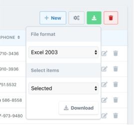

# Exportar / Descargar archivo

Belich permite descargar el modelo del recurso actual en formato: `csv`, `xls` y `xlsx`. La descarga se realiza desde el `index` de cada recurso.

Entre las opciones de descarga que tenemos, podemos encontrar:

El formato y si queremos descargar todo, o solo los campos seleccionados.

#### Configuración del driver

Belich, permite utilizar diversos drivers de conversión de archivos. Por defecto utiliza [FastExcel](https://github.com/rap2hpoutre/fast-excel).

Para configurar el driver, hay que hacerlo desde el archivo de configuración, ubicado en:

~~~
.\Config\belich.php
~~~

En el encontrará el siguiente código:

~~~
/*
|--------------------------------------------------------------------------
| Export file (xls, xlsx, csv) from supported drivers
|--------------------------------------------------------------------------
|
| Belich has support for:
|
| @Driver: Fast Excel
| @Github: https://github.com/rap2hpoutre/fast-excel
| @value: 'fast-excel'
|
*/
'export' => [
    'driver' => 'fast-excel',
],
~~~

Actualmente, los drivers soportados son:

- `fast-excel`
- `maatwebsite` (En desarrollo, actualmente hay en error con el package...)
