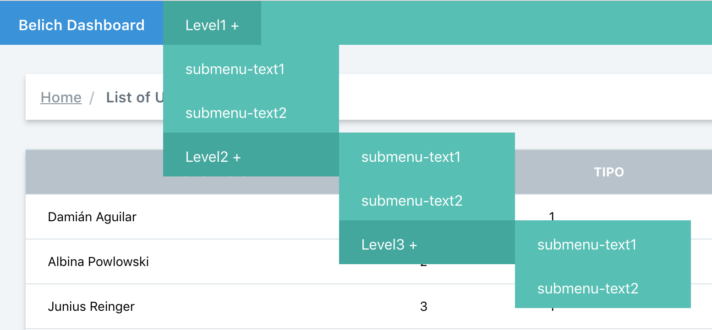

# Barra de navegación

Automáticamente, Belich genera el archivo: `App\Belich\Navbar.php` este archivo, es el que generea el menú de navegación superior.

Por defecto, Belich generará automáticamente el menú en base a los recursos añadidos a la carpeta: `App\Belich\Resources`.

Para agrupar los recursos, utilizaremos la variable `$group`, que deberemos añadir a nuestro recurso, de la siguiente forma:

~~~
/** @var string [Model path] */
public static $model = '\App\Models\Billing';

/** @var bool */
public static $displayInNavigation = true;

/** @var string */
public static $group = 'Billing';

/** @var string */
public static $label = 'Invoice';

/** @var string */
public static $pluralLabel = 'Invoices';
~~~

En el ejemplo anterior, se muestra como sería la configuración de variables de un recurso.

Todos, los recursos que compartan la variable `$group`, estarán agrupados en el mismo menú desplegable.

En el archivo `App\Belich\Navbar.php`, podremos encontrar:

~~~
/**
 * Generate the navbar
 *
 * @param Illuminate\Support\Collection $resources
 * @return void
 */
public static function make(Collection $resources)
{
    //Generate the default navbar from the resources
    return Parent::resourcesForNavigation($resources);
}
~~~

Que generará una barra de navegación de forma automática a partir de nuestros recursos y como los agrupemos.

Pero también podemos personalizar la barra de navegación. Belich, utiliza el sistema de menús de https://docs.spatie.be/menu/v2 el cual soporta tres niveles de profundidad en los menus. A continuación se muestra un ejemplo del menu:

Este menú, se consigue con el siguiente código:

~~~
/**
 * Generate the navbar
 *
 * @param Illuminate\Support\Collection $resources
 * @return void
 */
public static function make(Collection $resources)
{
    //Belich use https://docs.spatie.be/menu/v2
    //This will be an example for custom menu with 3 level depths
    return
        Menu::new()
            ->add(Parent::brand())
                ->submenu(Link::to('#', 'Level1'), Menu::new()
                        ->link('/text1', 'submenu-text1')
                        ->link('/text2', 'submenu-text2')
                        ->submenu(Link::to('#', 'Level2'), Menu::new()
                            ->link('/text1', 'submenu-text1')
                            ->link('/text2', 'submenu-text2')
                            ->submenu(Link::to('#', 'Level3'), Menu::new()
                                ->link('/text1', 'submenu-text1')
                                ->link('/text2', 'submenu-text2')
                            )
                        )
                );
}
~~~

Por lo que siguiendo el esquema anterior, podemos crear el menú personalizado que deseemos, de forma rápida y sencilla. Pero Belich, también dispone de unos helpers, que nos facilitarán la tarea de personalizar nuestro menu.

### Métodos para la creación de menus

El primero de todos, y que puede verse en el ejemplo anterior, es el

